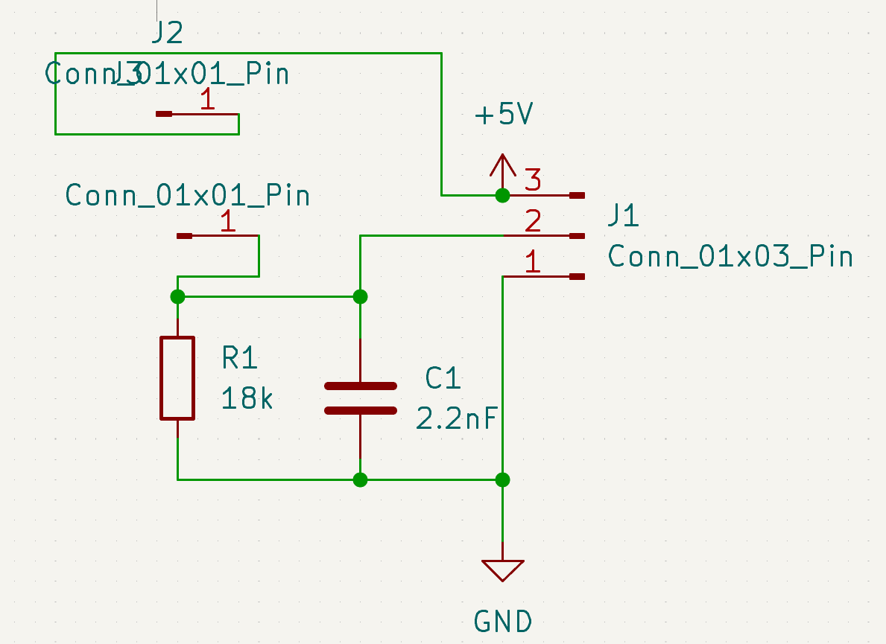
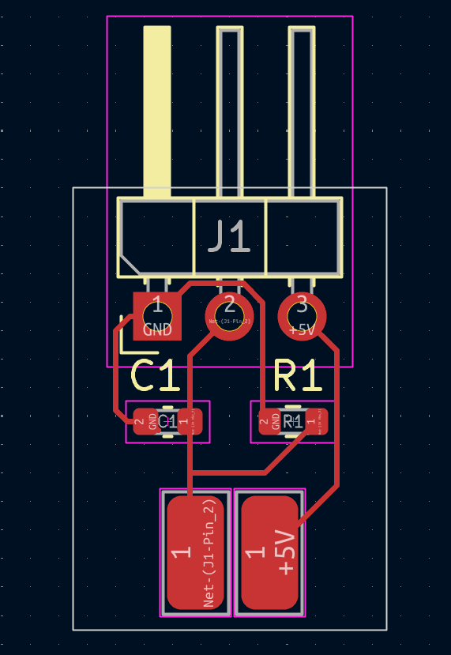
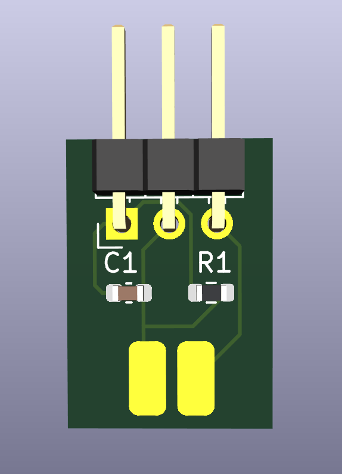
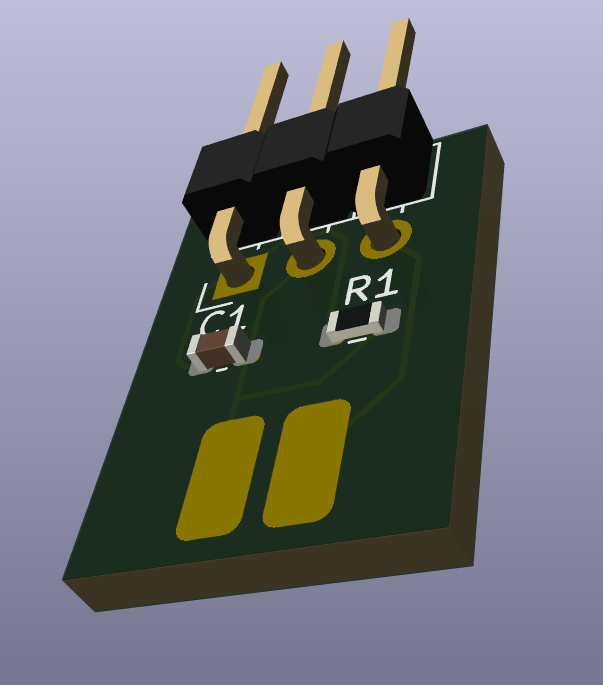
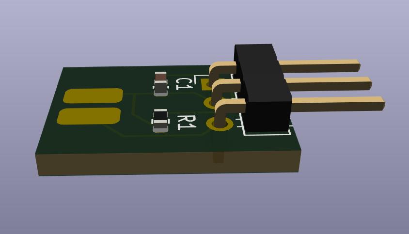

# Thin-Film Sensor PCB Module

## *VT CRO and The Workcell*

This PCB is the **first custom PCB I designed** for my robotics club, **VT CRO (Virginia Tech Competitive Robotics Organization)**, specifically for *[The Workcell](https://www.vtcro.org/design-teams/mwc)*.

The Workcell is a **fully autonomous 3D-printing farm** that VT CRO began developing in Fall 2023. The project went on to win national recognition in Spring 2024, including the **Honda Innovation Award** and the **Additive Manufacturing Award** at the **National Robotics Challenge (Ohio)**.

In Fall 2025, the team decided to **open-source the project** and develop a **V2 system**, which includes major redesigns across the **mechanical, software, and electrical** subsystems. As part of this effort, several **new custom PCBs** were designed for improved modularity, reliability, and scalability.

This repository focuses specifically on **one of those custom PCBs**. I won’t go into detail about the entire Workcell here, but feel free to explore VT CRO’s website for more background. Once the Workcell V2 is fully open-sourced, I’ll link the full project here as well.

---

## *Custom PCB Purpose*

This PCB is part of a **larger plate-detection system** used within the Workcell. The board is a **small, modular thin-film sensor PCB** designed to be soldered **at a 90-degree angle** to a larger **shift-register PCB** designed by one of my teammates.

Each thin-film sensor module is mounted along the **3D-printed plate shelves** in the Workcell. When a build plate is placed onto a shelf, the thin-film force sensor detects the applied pressure and generates an electrical signal. This signal is then routed to the shift-register PCB, which reports the **binary presence/absence state** of each plate to the main control software.

This modular approach allows the sensing system to scale easily while keeping each sensing node simple, compact, and replaceable.

---

## *Schematic and Parts*

Commercial thin-film sensor modules do exist (for example, [this module on Amazon](https://www.amazon.com/Fafeicy-3-3-5V-Pressure-Sensor-Compatible/dp/B097RR4KLC)), but a core part of **VT CRO’s culture** is building systems **custom and from scratch**. It’s more educational, more flexible, and honestly more fun. Plus, we get to fabricate the PCB in **black**, our signature color, and include our **eagle logo**.

The schematic itself is intentionally simple. The thin-film force sensor ([example sensor](https://www.amazon.com/dp/B0FGD267GK)) behaves as a **force-dependent variable resistor** and is used as part of a **voltage divider**, producing an output voltage that varies with applied pressure.

This analog voltage is interpreted by the downstream digital system as a **logic high or low**, depending on whether it crosses the input threshold of the shift-register IC. The resistor (R1) and capacitor (C1) form an **RC network** that was iteratively tuned to:
- Smooth sensor noise and contact bounce  
- Provide a reasonable response time  
- Meet the voltage threshold and timing requirements specified in the shift-register datasheet  

In KiCad, I used **solder pads** rather than connectors for the thin-film sensor to keep the footprint compact and mechanically robust when mounted at a right angle.

---

## *Images*

### Schematic

### PCB Editor

### 3D Render

  
  

-->

